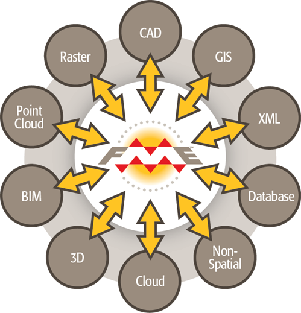
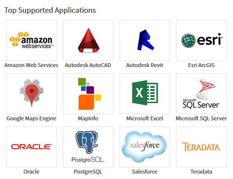

## How FME Works
At the heart of FME is an engine that supports an array of data types and data formats; from GIS and CAD to BIM and Point Cloud, via XML, Raster, databases, and many more.

### Rich Data Model
The capability to handle so many data types is made possible by a rich data model designed to cover all possible geometries and attributes. 

When limitations in the destination (output) format cause incompatibility, FME automatically compensates to create a seamless translation process.

Check out our web site for a [full list of data formats](http://www.safe.com/fme/format-search/#!) supported in FME

---
<!--Person X Says Section-->

<table style="border-spacing: 0px">
<tr>
<td style="vertical-align:middle;background-color:darkorange;border: 2px solid darkorange">
<i class="fa fa-quote-left fa-lg fa-pull-left fa-fw" style="color:white;padding-right: 12px;vertical-align:text-top"></i>
Miss Vector says...
</td>
</tr>

<tr>
<td style="border: 1px solid darkorange">

I'm back! If you read this section (or even if you didn't) you should be able to answer this simple question:  
  FME Desktop can seamlessly translate between so many formats because it has...?
  1. A sentient data dictionary
 2. A retro-encabulator
 3. A rich data model
 4. A core of unicorn hairs

</td>
</tr>
</table>