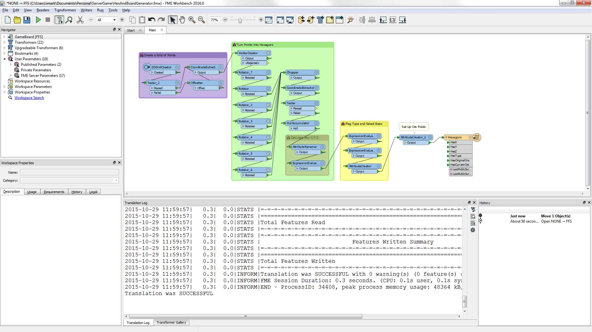

# FME Desktop Components #
FME Desktop consists of a number of different tools and applications.

 
## FME Desktop Applications ##
The two key applications within FME Desktop are **FME Workbench** and the **FME Data Inspector**.

### FME Workbench ###
FME Workbench is the primary tool for defining data translations and data transformations. It has an intuitive point-and-click graphic interface to enable translations to be graphically described as a flow of data.

### FME Data Inspector ###
The FME Data Inspector is a tool for viewing data in any of the FME supported formats. It is used primarily for previewing data before translation or reviewing it after translation.

## FME Utilities ##
Besides Workbench and the Data Inspector, there are several other FME utilities.

### Help ###
A help window for FME that refreshes automatically as you click on items in FME Workbench.

### FME Quick Translator ###
A precursor to FME Workbench that is used only for quick translations requiring no data transformation.

### FME Integration Console ###
A tool for applying FME functionality to other GIS and CAD applications; commonly enabling use of datasets not normally supported by those applications.

### FME Licensing Assistant ###
An application for managing FME licensing.

## Other FME Desktop Components ##
Additional components are also included as part of FME Desktop (Professional Edition or higher).

### FME Command Line Engine ###
The FME Command Line Engine enables translations to be initiated at the command line level.

### FME Plug-In SDK ###
The FME Plug-In SDK allows developers to add formats and functionality to the FME core.

---

<!--Person X Says Section-->

<table style="border-spacing: 0px">
<tr>
<td style="vertical-align:middle;background-color:darkorange;border: 2px solid darkorange">
<i class="fa fa-quote-left fa-lg fa-pull-left fa-fw" style="color:white;padding-right: 12px;vertical-align:text-top"></i>
Miss Vector says...
</td>
</tr>

<tr>
<td style="border: 1px solid darkorange">

As we work through the course the questions will get harder. Still, this one is pretty easy: 
  Which of the following applications is NOT a part of FME Desktop?
  1. FME Workbench
 2. FME Integration Console
 3. FME Server Console
 4. FME Data Inspector

</td>
</tr>
</table>

