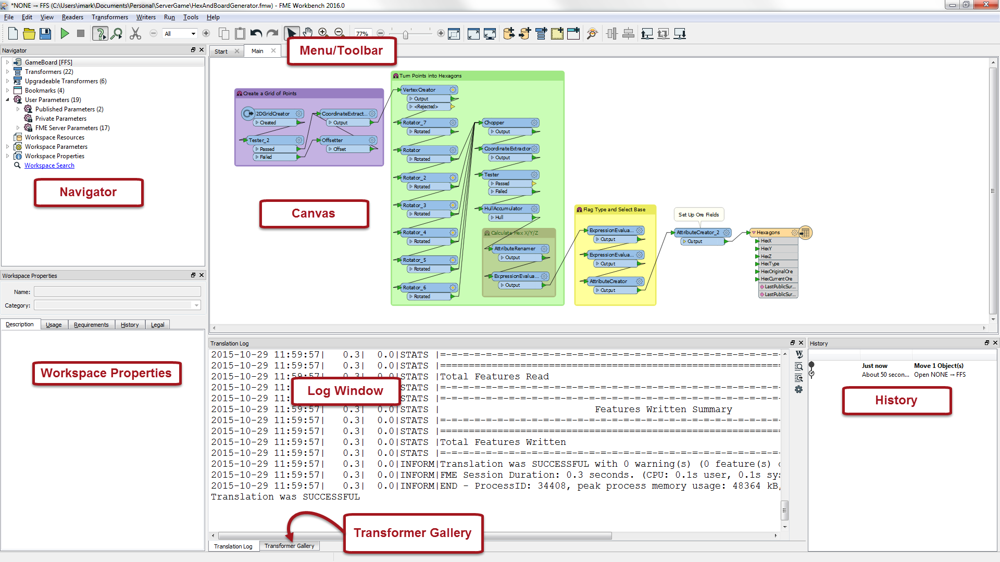
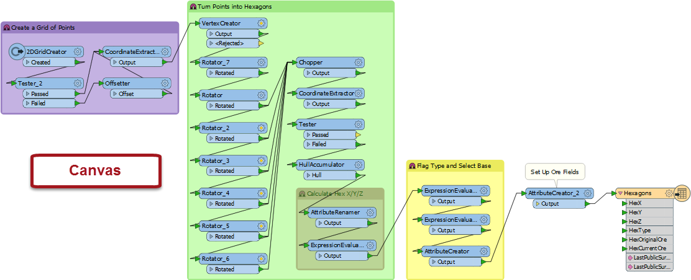
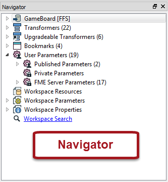

# Major Components of FME Workbench #

The FME Workbench user interface has a number of major components:

## Menu/Toolbar ##
The menubar and toolbar contain a number of tools: for example, tools for navigating around the Workbench canvas, controlling administrative tasks, and adding or removing Reader (source) datasets.

## Canvas ##
The FME Workbench canvas is where users graphically define a translation. This definition is called a "workspace" and can be saved for re-use later.

By default the workspace reads from left to right; data source on the left, transformation tools in the center, and data destination on the right. Connections between each item represent the flow of data and may branch in different directions, merge together, or any combination of the two.

The canvas is the primary window within Workbench and the focus of all your work.

---
<!--Person X Says Section-->

<table style="border-spacing: 0px">
<tr>
<td style="vertical-align:middle;background-color:darkorange;border: 2px solid darkorange">
<i class="fa fa-quote-left fa-lg fa-pull-left fa-fw" style="color:white;padding-right: 12px;vertical-align:text-top"></i>
Police Chief Webb-Mapp says...
</td>
</tr>

<tr>
<td style="border: 1px solid darkorange">

I'm the police chief for FME, and what I say is the law!  
  To be precise the application itself is called “Workbench”, but the process defined in the canvas window is called a “Workspace”. The terms are so similar that they are easily confused, but please don't, otherwise I will have to send my grammar squad to arrest you! 
  Although mistreating FME terminology is a minor offence the ignominy of being caught is long lasting!!!

</td>
</tr>
</table>
---

## Navigator ##
The Navigator window is a structured list of parameters that represent and control all of the components on your workspace canvas.

## Transformer Gallery ##
The transformer gallery is a tool for the location and selection of FME transformation tools.

## Translation Log ##
The log window (translation log) shows a report on translation results. Information includes any warning or error messages, translation status, length of translation, and number of features processed.

## History ##
The History window displays the workspace editing history. It is a form of tree-based undo/redo that allows a user to revisit previous revisions in a workspace.

## Workspace Properties ##
A minor window in which a workspace author can enter information (metadata) about the workspace.

---

<!--Person X Says Section-->

<table style="border-spacing: 0px">
<tr>
<td style="vertical-align:middle;background-color:darkorange;border: 2px solid darkorange">
<i class="fa fa-quote-left fa-lg fa-pull-left fa-fw" style="color:white;padding-right: 12px;vertical-align:text-top"></i>
Miss Vector says...
</td>
</tr>

<tr>
<td style="border: 1px solid darkorange">

Here's your question for this section. Personally I think we should implement all of these answers!
  Which of these is a window in FME Workbench?
  1. The Maths Window
 2. the Geography Window
 3. The English Literature Window
 4. The History Window

</td>
</tr>
</table>

