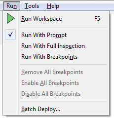
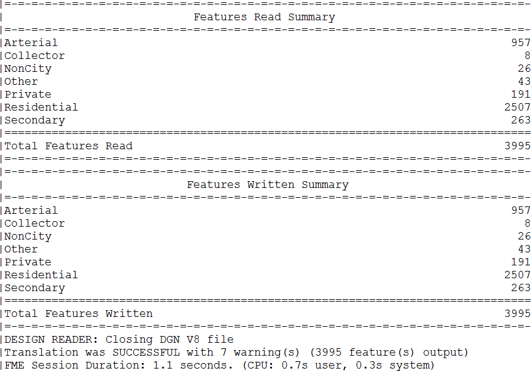

## Running a Workspace ##

The green arrow (or 'play' button) on the Workbench toolbar starts a translation:

Alternatively, look under Run on the menubar:

The same toolbar options appear on both the menubar and toolbar. Notice the shortcut option F5 can be used instead: 

---
<!--New Section--> 

<table style="border-spacing: 0px">
<tr>
<td style="vertical-align:middle;background-color:darkorange;border: 2px solid darkorange">
<i class="fa fa-bolt fa-lg fa-pull-left fa-fw" style="color:white;padding-right: 12px;vertical-align:text-top"></i>
NEW
</td>
</tr>

<tr>
<td style="border: 1px solid darkorange">

The action of the Run button is modified by a series of options. These options include the ability to prompt the user for input (Run with Prompt), the ability to inspect the data (Run with Full Inspection) and the ability to run in debug mode (Run with Breakpoints).
  Existing users will notice this setup is different from previous versions of FME (where each of these options had a separate run button).
  For now, we can ignore these options and just use the Run Workspace option without modifiers.

</td>
</tr>
</table>
---

 
## Workspace Results ##
After running a workspace related information and statistics are found in the translation log, which is displayed in the Workbench log window.

The translation log reveals whether the translation succeeded or failed, how many features were read from the source and written to the destination, and how long it took to perform the translation.

In this example the log file reveals that 3995 features were read from a MicroStation DGN file.

These features were written to a MapInfo TAB dataset..

The overall process was a success (with some warnings).

The elapsed time for the translation was 1.1 seconds.

---

<!--Person X Says Section-->

<table style="border-spacing: 0px">
<tr>
<td style="vertical-align:middle;background-color:darkorange;border: 2px solid darkorange">
<i class="fa fa-quote-left fa-lg fa-pull-left fa-fw" style="color:white;padding-right: 12px;vertical-align:text-top"></i>
Miss Vector says...
</td>
</tr>

<tr>
<td style="border: 1px solid darkorange">

I bet you've got all of the questions correct so far - and you should get this one too:
  Which of these is NOT a way to set the format of a translation?
  1. Typing the format name
 2. Selecting the format from a drop-down list
 3. Browsing for the format in the formats gallery
 4. By selecting a dataset with a known file extension
 5. None of the above (they are all valid ways to set the format)

</td>
</tr>
</table>
