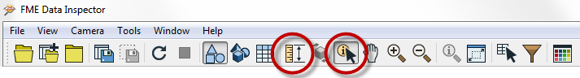
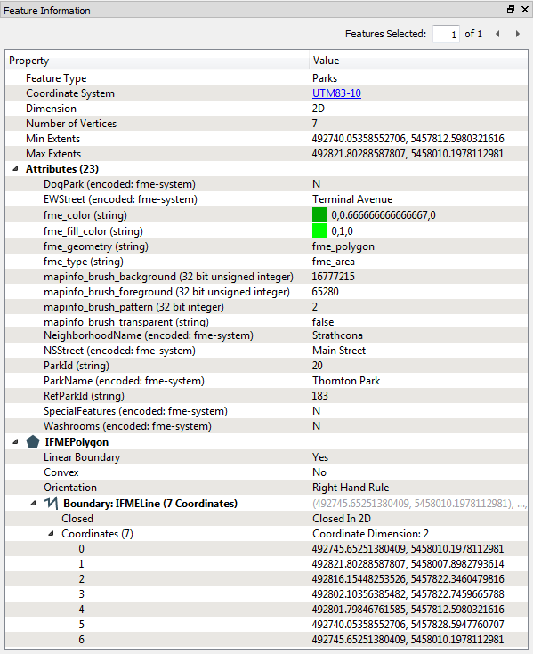
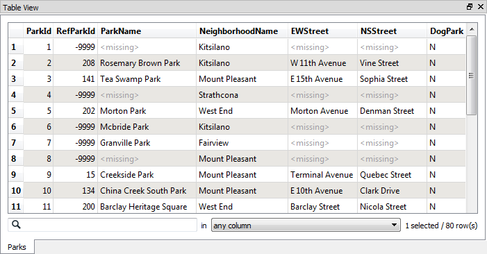

## Inspecting Data ##
Querying tools are

- Query individual feature(s)
- Measure a distance within a View window

By default the Query tool is active when you start the FME Data Inspector.

Clicking the toolbar Query button at this point only turns the tool off.

The results of a feature query are shown in the Feature Information window.

### Feature Information Window ###
The upper part reports on general information about the feature; which feature type (layer) it belongs to, which coordinate system it is in, whether it is two- or three-dimensional, and how many vertices it possesses.

The middle part reports the attributes associated with the feature. This includes user attributes and format attributes (for example fme_type).

The lower part reports the geometry of the feature. It includes the geometry type and a list of the coordinates that go to make up the feature.

### Table View Window ###
Also available is a window called the Table View.

The table view is a way to inspect data in a tabular, spreadsheet-like, layout. Although it does not have the same depth of information shown by the Information Window, the Table View is particularly useful for inspecting the attribute values of multiple features simultaneously.