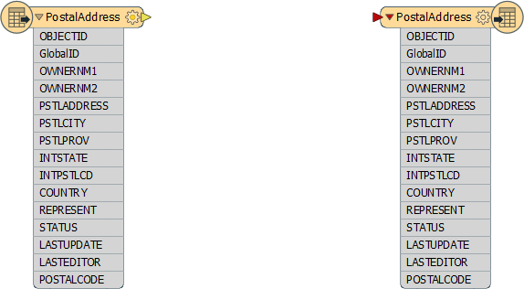
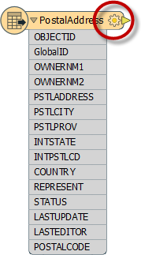
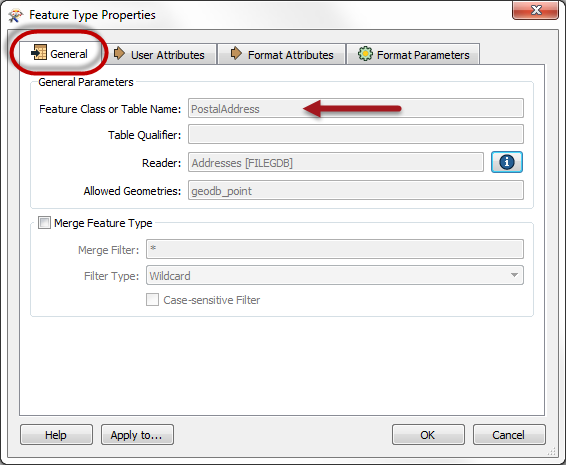
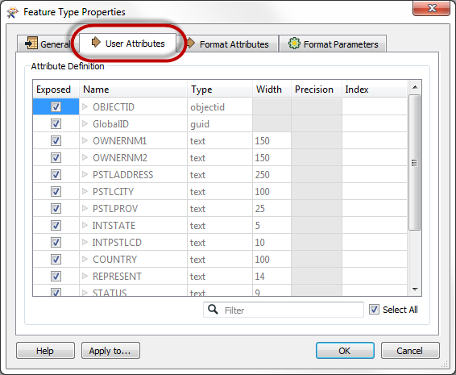
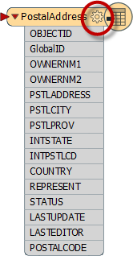

# Structural Transformation #
Transforming a dataset’s structure requires knowledge of *schemas* and how to use FME to manipulate them.
 
## Schema Concepts ##
A ***schema*** is the structure of a dataset or, more accurately, a formal definition of a dataset’s structure. FME uses the term ‘schema’, but you may know this as 'data model'.

Each dataset has its own unique schema; it includes layers, geometries, attributes, and other rules that define or restrict its content.

### Schema Representation ###
When a new workspace is created, FME scans the source datasets and creates a visual representation of its schema on the left side of the workspace canvas. 

On the right side of the canvas, FME creates a representation of how this schema will be duplicated in the chosen destination format.

The workspace therefore reads from left to right.

### Feature Type Schemas ###
A schema is not just represented as a set of layers on the Workbench canvas; for example, each different layer in a dataset can have a different structure. 

This part of the schema is revealed by clicking the cog-wheel icon on the canvas object representing that layer.

This opens the Feature Type Properties dialog. This dialog represents schema under a number of tabbed tables.

Under the General tab there is the name of the feature type, in this case PostalAddress.

Allowed geometry types and the name of the parent dataset for the feature types are shown as well.

The User Attributes tab shows a list of attributes. Each attribute is defined by its name, data type, width, and number of decimal places.

### Writer Schema ###
All of the above information goes to make up the Reader schema. It is literally ***"what we have"***.

There is also a schema for each Writer in FME. You can find it by opening the properties dialog for a Writer feature type:

By default, the Writer schema (***"what we want"***) is a mirror image of the source, so the output from the translation will be a duplicate of the input. This allows users to translate from format to format without further edits (Quick Translation).

If 'what we want' is different to the default schema in FME, we simply have to change it using ***Schema Editing***.

---

<!--Tip Section--> 

<table style="border-spacing: 0px">
<tr>
<td style="vertical-align:middle;background-color:darkorange;border: 2px solid darkorange">
<i class="fa fa-info-circle fa-lg fa-pull-left fa-fw" style="color:white;padding-right: 12px;vertical-align:text-top"></i>
TIP
</td>
</tr>

<tr>
<td style="border: 1px solid darkorange">

FME supports 300+ formats and there are almost as many terms for the way data is subdivided. The most common terms are layer, table, class, category, level, or object.
  As noted, the general FME term for these subdivisions is Feature Type, and that is what is used throughout the manual.
  Be aware though, that all dialogs in FME Workbench use format-specific terminology. So, screenshots in the manual may display different terms depending on what format of data is being used!

</td>
</tr>
</table>
