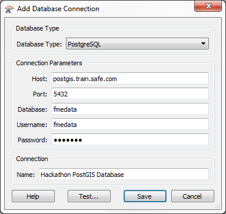
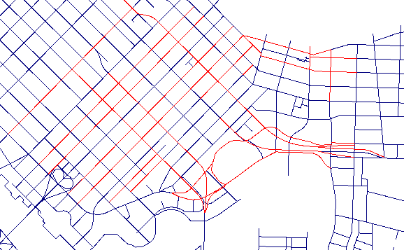
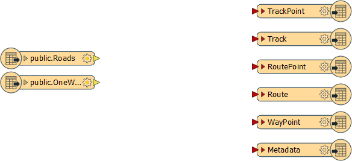
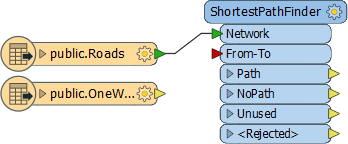
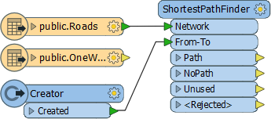
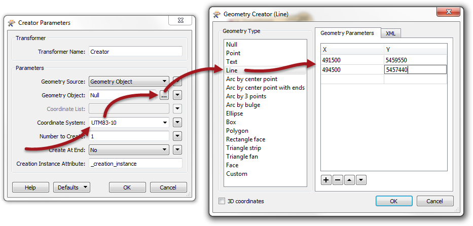
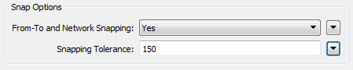

<!--Exercise Section-->
<!--NB: In GitBook world we don't give a number to exercises-->

<table style="border-spacing: 0px;border-collapse: collapse;font-family:serif">
<tr>
<td style="vertical-align:middle;background-color:darkorange;border: 2px solid darkorange">
<i class="fa fa-cogs fa-lg fa-pull-left fa-fw" style="color:white;padding-right: 12px;vertical-align:text-top"></i>
Exercise
</td>
<td style="border: 2px solid darkorange;background-color:darkorange;color:white">
FME Hackathon
</td>
</tr>

<tr>
<td style="border: 1px solid darkorange; font-weight: bold">Data</td>
<td style="border: 1px solid darkorange">Roads (Autodesk AutoCAD DWG, Esri Shape, and/or PostGIS)</td>
</tr>

<tr>
<td style="border: 1px solid darkorange; font-weight: bold">Overall Goal</td>
<td style="border: 1px solid darkorange">Find the shortest route from the hackathon to an Italian Cafe</td>
</tr>

<tr>
<td style="border: 1px solid darkorange; font-weight: bold">Demonstrates</td>
<td style="border: 1px solid darkorange">Data Translation, Transformation, and Best Practice</td>
</tr>

<tr>
<td style="border: 1px solid darkorange; font-weight: bold">Start Workspace</td>
<td style="border: 1px solid darkorange">None</td>
</tr>

<tr>
<td style="border: 1px solid darkorange; font-weight: bold">End Workspace</td>
<td style="border: 1px solid darkorange">C:\FMEData2016\Workspaces\DesktopBasic\BestPractice-Ex4-Complete.fmwt</td>
</tr>

</table>

A local GIS group is holding an FME Hackathon and you have been invited to take part.

You have been provided with a set of source data and asked to create a useful project from it. You decide that it would be interesting to produce a tool that maps the route from the hackathon venue to a cafe the where a group get-together will be held that evening.  

So, your task is to use the data available to you to calculate the best route from the convention centre to the cafe, and to write out that data to GPX format so folk can use it in their GPS/mobile device.

---

**1) Create Database Connection**
 The source data has been provided in a PostGIS database; therefore our first task should be to create a connection to it. That way we can use the connection instead of having to enter connection parameters.

In a web browser visit [http://fme.ly/database](http://fme.ly/database) - this will show the parameters for a PostGIS database running on Amazon RDS.

In Workbench, select Tools > FME Options from the menubar

Click on the icon for the Database Connections category, then click the [+] button to create a new connection. In the "Add Database Connection" dialog, first select PostgreSQL as the database type. Then enter the connection parameters obtained through the web browser.

Give the connection a name (such as Hackathon PostGIS Database) and click Save. Then click OK to close the FME Options dialog.

 **2) Inspect Data**
 Start the FME Data Inspector to inspect the dataset we will be using. Select File > Open Dataset and, when prompted, enter the following:

<table style="border: 0px">

<tr>
<td style="font-weight: bold">Reader Format</td>
<td style="">PostGIS</td>
</tr>

<tr>
<td style="font-weight: bold">Reader Dataset</td>
<td style="">Hackathon PostGIS Database</td>
</tr>

<tr>
<td style="font-weight: bold">Parameters</td>
<td style="">Under Table List choose Roads and One-Way Streets</td>
</tr>

</table>

Click OK to close the dialogs and open the data. Change the color of the one-way streets so you can see that they are a different set of features. It's important to know which roads are one-way if we want to calculate a route that is actually legal!

***NB**: If you have any problems using the PostGIS database - for example connectivity problems with a firewall - then the following AutoCAD dataset can be substituted with very few changes required:*

<table style="border: 0px">

<tr>
<td style="font-weight: bold">Reader Format</td>
<td style="">Autodesk AutoCAD DWG/DXF</td>
</tr>

<tr>
<td style="font-weight: bold">Reader Dataset</td>
<td style="">C:\FMEData2016\Data\Transportation\OneWayStreets.dwg</td>
</tr>

</table>

 **3) Start Workbench**
 Start Workbench and use the option to Generate a workspace.

<table style="border: 0px">

<tr>
<td style="font-weight: bold">Reader Format</td>
<td style="">PostGIS</td>
</tr>

<tr>
<td style="font-weight: bold">Reader Dataset</td>
<td style="">Hackathon PostGIS Database</td>
</tr>

<tr>
<td style="font-weight: bold">Parameters</td>
<td style="">Under Table List choose Roads and One-Way Streets</td>
</tr>

<tr>
<td style="font-weight: bold">Writer Format</td>
<td style="">GPS eXchange Format (GPX)</td>
</tr>

<tr>
<td style="font-weight: bold">Writer Dataset</td>
<td style="">C:\FMEData2016\Output\Training\Route.gpx</td>
</tr>

</table>

The workspace will look like this:

For the sake of Best Practice, you may want to put a bookmark around these features, and maybe annotate which are the one-way streets.

 **4) Add ShortestPathFinder**
 Now we need to start calculating a route. The obvious first step is to add a ShortestPathFinder transformer, which is how we can calculate our route.

So, add a ShortestPathFinder transformer. Connect Roads to the Network port.

 **5) Add Creator**
 The other input port on the ShortestPathFinder is for the From-To path (the start and end points of our journey). To add a feature to input here we can manually create it with the Creator transformer. 

Add a Creator transformer and connect it to the From-To port.

Open the Creator parameters dialog.

Firstly enter UTM83-10 as the coordinate system of the data we are about to create. For the Geometry Object parameter, click the [...] browse button to the right to open a geometry-creation dialog. Select Line as the geometry type and enter the following coordinates:

<pre>
X 491500 Y 5459550
X 494500 Y 5457440
</pre>

The first coordinate is that of the hackathon venue and the second is the closest point in our network to the cafe we're going to visit.

Click the OK button to close the dialog.

 **6) Check ShortestPathFinder Parameters**
 The coordinates of the feature we've added might not sit exactly on the road network. To get around this issue there are parameters we can use in the ShortestPathFinder.

So, open the ShortestPathFinder parameters dialog. Under Snap Options set From-To Snapping to Yes and enter 150 as the Snapping Tolerance:

Also notice that there are parameters for network costs - we'll be making use of those later.

 **7) Run Workspace**
 Add some Inspector transformers after the ShortestPathFinder and run the workspace to prove it is working up to this point.

If all has gone well, the output will look like this, with a route defined:

Of course, if all has not gone correctly, you must make use of Inspector and Logger transformers, plus Feature Debugging, to try and locate the error!

 **8) Add ChangeDetector**
 The result looks fine, but there are some things we are yet uncertain about: what if the route takes us the wrong way down a one-way street; and what if it uses slower, residential routes?

The first issue we can fix - most quickly - by ignoring one-way streets (i.e. avoiding them).

This we can implement in FME by matching up one-way streets so we can remove them from the network.

Add a ChangeDetector transformer to the workspace. Connect the Roads feature types to the Original port and the OneWayStreets feature type to the Revised port: i.e the Roads feature type includes one-way streets, and we can match them with the One-Way Streets feature type
to filter them out:

Open up the ChangeDetector parameters. Note that we are matching geometry (correct) so don't change any parameters, just click OK to close the dialog.

By using the ChangeDetector road features that match a one-way street will emerge from the Unchanged port, so we should leave this unconnected. Similarly, Added features will be oneway streets that haven't been matched, and we can leave these out too.

So connect the Deleted port to the ShortestPathFinder Network port. The "Deleted" features are those that the transformer thinks have been deleted because they exist as roads, but not in the one-way data.

 **9) Re-Run Workspace**
 Now re-attach any Inspector transformers (if necessary) and re-run the workspace. Check the new route. If it has changed from before then you know this is because it is now avoiding oneway streets. This might not be the shortest route, but it's one we can confidently follow without heading directly into incoming traffic!

 **10) Add AttributeValueMapper**
 To weight our route in favour of arterial roads (not residential) we need to give each type of route a cost.

The best solution is an AttributeValueMapper transformer; so place one of these into the workspace. 

After the ChangeDetector will be the best location, as then some features will have already been filtered out and this transformer will have less work to do.

 **11) Edit AttributeValueMapper**
 Now we can set up the AttributeValueMapper transformer. Open its parameters dialog:

- Select 'type' as the Source Attribute
- Enter Cost as the Destination Attribute
- Enter 2 as the Default Value

Now, underneath those parameters, we'll map some data.

Enter "Arterial" into the first Source Value field and a value of 1 in the matching Destination Value.

Enter "Residential" into the second Source Value field and a value of 3 in the matching Destination Value.

Basically, if the route is arterial (a main road) it will get a cost of 1; residential routes will get a cost of 3 and all other types will get a cost of 2 (because that's the default value). Click OK to close the dialog.

 **12) Apply Costs**
 Now we'll apply that newly calculated cost in the ShortestPathFinder. 

Open the ShortestPathFinder parameters dialog. Set the Cost Type parameter to be "By Two Attributes".

Select "Cost" as the attribute for both the Forward and Reverse cost parameters (i.e. it will cost the same whichever direction the road feature runs and whichever direction we travel along it).

 **13) Run Workspace**
 The workspace will now look like this:

Save and then run the workspace. You'll find that your new route directs you from the convention centre to Commercial Drive avoiding one-way streets and taking the slowness of residential routes into account.

 **14) Connect Schema**
 Oh! Don't forget to remove the Inspector transformers and connect the Path port to the Route output feature type:

Now run the workspace, upload the data to your GPS device, and you are ready to go!

 **Advanced**
 Not really advanced, but you did use Best Practice throughout, right? I mean, you have bookmarks and annotations where needed, and no overlapping connections? If not, well you might want to fix that!

Congratulations! You have now:

> completed the exercise for this chapter.