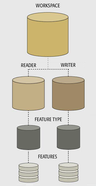
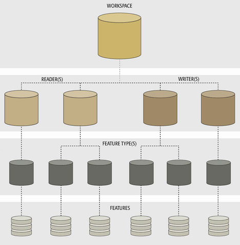

## Component Hierarchy ##
It’s important to notice that all these components exist in a related hierarchy:

The workspace is at the top level, followed by Readers and Writers, feature types, then features.

Hierarchy is an important concept because it affects how components are added to a translation, and - more importantly - how they are controlled.

### One-To-Many Relationships ###

The hierarchical relationship between workspace, readers, writers, feature types, and features isn't always one-to-one; often it is a one-to-many (1:M) relationship with the level beneath:

A single workspace can contain any number of Readers and Writers, each Reader can contain a number of feature types, and each feature type can contain any number of features within it.

This means that a single workspace can read and write multiple datasets, in multiple formats, with multiple layers, and multiple features per layer.

Now we know what these components are, let's look at each of them individually, in detail, to see how they can be managed and how they can be controlled.
