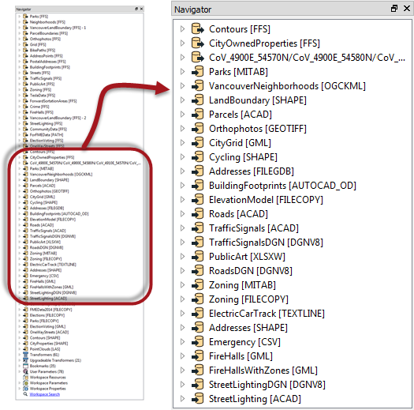
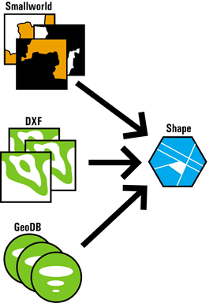
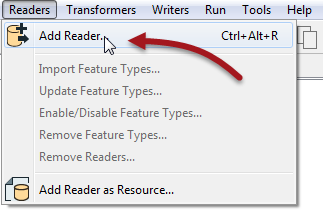
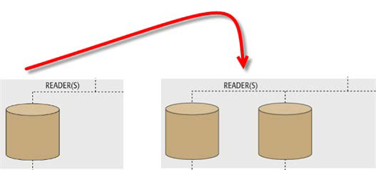
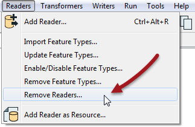

## Readers ##
***Readers*** are the main components that read data in FME.

A Reader is the FME term for the component in a translation that reads a source dataset. A Reader reads a single format of data, so to read multiple formats requires multiple Readers. However, each Reader can read any number of datasets in its format.

By default, the Generate Workspace dialog creates workspace with a single Reader (and a single Writer). However, this does not mean the workspace is forever limited to this. Additional Readers can be added to a workspace at any time, any number of formats can be used, and there does not need to be an equal number of Readers and Writers.

For example, the Navigator window shows this workspace contains 50+ Readers and Writers of all data types and formats!

---

<!--Person X Says Section-->

<table style="border-spacing: 0px">
<tr>
<td style="vertical-align:middle;background-color:darkorange;border: 2px solid darkorange">
<i class="fa fa-quote-left fa-lg fa-pull-left fa-fw" style="color:white;padding-right: 12px;vertical-align:text-top"></i>
Dr. Workbench says...
</td>
</tr>

<tr>
<td style="border: 1px solid darkorange">

It's important to note that Readers and Writers don’t appear as objects on the Workbench canvas. Their feature types (layers) do, but Readers and Writers don't.
  Instead they are represented by entries in the Navigator window, as in the above screenshot.

</td>
</tr>
</table>

---

### Adding a Reader ###
Adding a Reader to a workspace is a common requirement. There are several reasons:

- The Generate Workspace dialog only adds a single Reader
- Each Reader handles only one format of data
- Different datasets (of the same format) may require reading with different parameters

Therefore the need to read multiple formats of data – such as Smallworld, DXF, and Geodatabase – requires multiple Readers.

Additional Readers are added to a translation using Readers>Add Reader from the menubar.

Adding a Reader has this effect on the hierarchy diagram:

---

### Removing a Reader ###
Not only can you add a new Reader, you can remove an existing one; for example when you have an old Reader whose input you no longer need. Tools exist to remove a Reader from a workspace, both on the menubar and in context menus in the Navigator window.

Removing a Reader obviously has the reverse effect on the hierarchy diagram!