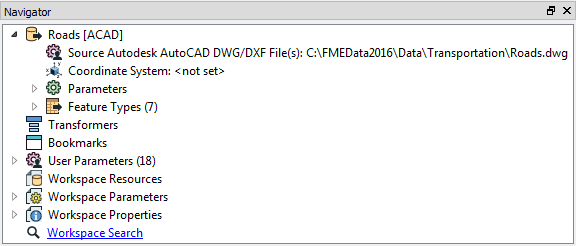

## Reader Dataset Parameters ##

Of course, perhaps the most important parameter is that which defines the dataset to be read. This too is found in the Navigator window:

As usual, double-clicking the parameter opens a dialog for it to be changed. You can change the dataset being read by selecting any other dataset - of the same format - within that dialog.

### Multiple Dataset Selection ###
As long as the format is file-based (i.e. not a database) a Reader is capable of reading multiple source datasets:

To do this, when selecting the dataset to read simply select multiple files instead of a single one.

---

<!--Tip Section--> 

<table style="border-spacing: 0px">
<tr>
<td style="vertical-align:middle;background-color:darkorange;border: 2px solid darkorange">
<i class="fa fa-info-circle fa-lg fa-pull-left fa-fw" style="color:white;padding-right: 12px;vertical-align:text-top"></i>
TIP
</td>
</tr>

<tr>
<td style="border: 1px solid darkorange">

When selecting a source dataset, an advanced file browser is available. This allows you to select files from different folders, all at the same time!
  

</td>
</tr>
</table>

---

### File Dataset Types ###
When dealing with files it's useful to consider datasets as existing in two differnt forms: File-based and Folder-based

#### File-Based Datasets ####
A file-based dataset is just that: a single file that contains all layers of data. A format of this type has an internal structure that assigns data to different layers within the file.

Good examples of this are: 

- **AutoCAD DWG**: Each DWG file is a dataset containing its own set of layers
- **Microsoft Excel**: Each Excel file is a dataset containing a set of sheets

In this scenario the dataset parameter is simply a pointer to the location of the file(s), here a single AutoCAD dataset:

#### Folder-Based Datasets ####
A folder-based dataset is still made up of files (of course). However, a format of this type DOES NOT have an internal way to define layers. Therefore each layer becomes a separate file within a folder.

Good examples of this are:

- **Esri Shapefile**: To store different layers requires multiple Shapefiles: e.g. roads.shp and railways.shp
- **Comma-Separated (CSV)**: To store separate tables requires two separate CSV files

In this scenario the dataset parameter is a pointer to the individual files, here a set of layers in a shapefile dataset:

---

<!--Person X Says Section-->

<table style="border-spacing: 0px">
<tr>
<td style="vertical-align:middle;background-color:darkorange;border: 2px solid darkorange">
<i class="fa fa-quote-left fa-lg fa-pull-left fa-fw" style="color:white;padding-right: 12px;vertical-align:text-top"></i>
Sister Intuitive says...
</td>
</tr>

<tr>
<td style="border: 1px solid darkorange">

Both File or Folder dataset parameters can be pointers to a Zip file. You simply select the zip file in the source parameter and FME will extract the data when it is being read.
  Similarly, a File or Folder dataset can be read directly from a URL. Simply enter the URL into the source parameter. For Folder datasets the URL must point to a zip file containing all of the relevant files.

</td>
</tr>
</table>

