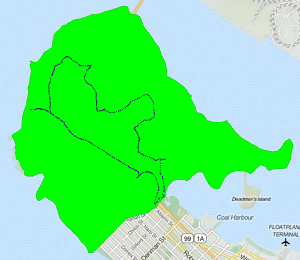

<!--Exercise Section-->
<!--NB: In GitBook world we don't give a number to exercises-->

<table style="border-spacing: 0px;border-collapse: collapse;font-family:serif">
<tr>
<td style="vertical-align:middle;background-color:darkorange;border: 2px solid darkorange">
<i class="fa fa-cogs fa-lg fa-pull-left fa-fw" style="color:white;padding-right: 12px;vertical-align:text-top"></i>
Exercise
</td>
<td style="border: 2px solid darkorange;background-color:darkorange;color:white">
Adding Readers
</td>
</tr>

<tr>
<td style="border: 1px solid darkorange; font-weight: bold">Data</td>
<td style="border: 1px solid darkorange">City Parks (MapInfo TAB) Walking Trail (CSV) Roads (AutoCAD DWG) Water Fountains (File Geodatabase) Car Parking (OpenStreetMap)</td>
</tr>

<tr>
<td style="border: 1px solid darkorange; font-weight: bold">Overall Goal</td>
<td style="border: 1px solid darkorange">Create a set of data for mapping a recreational event</td>
</tr>

<tr>
<td style="border: 1px solid darkorange; font-weight: bold">Demonstrates</td>
<td style="border: 1px solid darkorange">Readers and Reader Parameters</td>
</tr>

<tr>
<td style="border: 1px solid darkorange; font-weight: bold">Start Workspace</td>
<td style="border: 1px solid darkorange">C:\FMEData2016\Workspaces\DesktopBasic\Components-Ex2-Begin.fmw</td>
</tr>

<tr>
<td style="border: 1px solid darkorange; font-weight: bold">End Workspace</td>
<td style="border: 1px solid darkorange">C:\FMEData2016\Workspaces\DesktopBasic\Components-Ex2-Complete.fmw</td>
</tr>

</table>

Let's continue your work on the fundraising walk project.

In case you forgot, the city is hosting a fundraising walk for a major charity and you have been tasked with using FME to put together the data that will form the event map.  

In this part of the project we’ll add all of the source datasets to the workspace as a variety of Readers. We'll check the Reader parameters to make sure we're reading the data correctly.

 **1) Start Workbench**
 Start Workbench (if necessary) and open the workspace from Exercise 1. Alternatively you can open C:\FMEData2016\Workspaces\DesktopBasic\Components-Ex2-Begin.fmw

 **2) Add Reader**
 The existing workspace already has a Reader for MapInfo (parks) data. Now let's add one for the most important dataset - the walk trail. This was walked by a colleague and captured on his GPS device.

Select Readers > Add Reader from the menubar in Workbench. When prompted fill in the following details (but don't press OK):

<table style="border: 0px">

<tr>
<td style="font-weight: bold">Reader Format</td>
<td style="">CSV (Comma Separated Value)</td>
</tr>

<tr>
<td style="font-weight: bold">Reader Dataset</td>
<td style="">C:\FMEData2016\Data\GPS\WalkingTrail.csv</td>
</tr>

</table>

Now press the Parameters button. This brings up a parameters dialog that is rather large and looks like this:

The dialog includes various parameters for this Reader and a preview of what the source dataset looks like. By default the Separator Character should be a comma (change it to a comma if it is not) and the File Has Field Names parameter should be turned on.

In the lower part of the dialog - under Schema Attributes - change the type of the Latitude attribute to a Y_Coordinate and the Longitude attribute to an X_Coordinate:

By setting these parameters FME will convert the plain-text CSV data into true spatial features. Click OK to close this dialog and OK again to close the Add Reader dialog.

---

<!--Person X Says Section-->

<table style="border-spacing: 0px">
<tr>
<td style="vertical-align:middle;background-color:darkorange;border: 2px solid darkorange">
<i class="fa fa-quote-left fa-lg fa-pull-left fa-fw" style="color:white;padding-right: 12px;vertical-align:text-top"></i>
Judge GIS says...
</td>
</tr>

<tr>
<td style="border: 1px solid darkorange">

Some things just won't wait. It's important to set these parameters now as they affect how the schema is depicted on the canvas. If I mess this up I'd have to delete the Reader and re-add it.

</td>
</tr>
</table>

---

 **3) Add Reprojector**
 The one issue with the CSV data is that it is in a Latitude/Longitude coordinate system, and not the same UTM system as used by the parks data. Let's fix that by adding a Reprojector transformer to the workspace:

Open the Reprojector parameters dialog and set it to reproject from LL83 to UTM83-10

 **4) Add Reader**
 Let's add some more data. This time we'll add the car parking. Select Readers > Add Reader and choose the following data:

<table style="border: 0px">

<tr>
<td style="font-weight: bold">Reader Format</td>
<td style="">OpenStreetMap (OSM) XML</td>
</tr>

<tr>
<td style="font-weight: bold">Reader Dataset</td>
<td style="">C:\FMEData2016\Data\OpenStreetMap\Vancouver.osm</td>
</tr>

<tr>
<td style="font-weight: bold">Parameters</td>
<td style="">Feature Types: Use Specific Features</td>
</tr>

</table>

The parameter is important because it specifies what feature types we will be presented with:

If we go with the Broad feature types, we will be presented with a broad set of layers and car parks will be hidden inside Amenities. If we go with Specific feature types we can select only car parks by themselves.

So, click OK to close this dialog and OK to add the Reader. When prompted, deselect all feature types and leave only amenity_parking selected:

 **5) Add Reprojector**
 Like the trail data, OSM is in a Latitude/Longitude coordinate system, and not the same UTM system as used by the parks data. So add a second Reprojector to the workspace to reproject the amenity_parking feature type from LL84 to UTM83-10

 **6) Add Clipper**
 If you recall the OSM dataset covers the entire city, and yet we're restricting the map to the park boundaries. To cut the excess data away we'll use a Clipper transformer, so add one to the canvas. Then...

- Connect the Tester:Passed port to the Clipper:Clipper port. 
- Connect the osm:amenity_parking feature type to the Clipper:Clippee port:

 **7) Run Workspace**
 Feel free to add Inspector transformers and run the workspace to inspect what we have created so far.

---

<!--Exercise Congratulations Section--> 

<table style="border-spacing: 0px">
<tr>
<td style="vertical-align:middle;background-color:darkorange;border: 2px solid darkorange">
<i class="fa fa-thumbs-o-up fa-lg fa-pull-left fa-fw" style="color:white;padding-right: 12px;vertical-align:text-top"></i>
CONGRATULATIONS
</td>
</tr>

<tr>
<td style="border: 1px solid darkorange">

By completing this exercise you have learned how to:
  <li>Add Readers to a workspace
 <li>Set parameters when adding a new Reader
 <li>Convert CSV attributes into spatial features
 <li>Set a level of detail when reading OpenStreetMap data

</td>
</tr>
</table>
