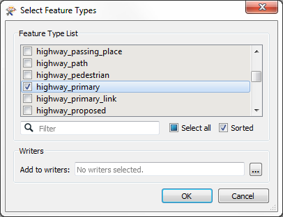

#ROADS

 **4) Add Reader**
 Let's add some more data. This time we'll add the roads. Select Readers > Add Reader and choose the following data:

<table style="border: 0px">

<tr>
<td style="font-weight: bold">Reader Format</td>
<td style="">Autodesk AutoCAD DWG/DXF</td>
</tr>

<tr>
<td style="font-weight: bold">Reader Dataset</td>
<td style="">C:\FMEData2016\Data\Transportation\Roads.dwg</td>
</tr>

<tr>
<td style="font-weight: bold">Reader Parameters</td>
<td style="">Group Entities By: Attribute Schema</td>
</tr>

</table>

Like CSV, this is one of those times we need to set the Reader parameters when adding the Reader. Now we have to decide what feature types to add to the canvas. Really we are only working with major roads so, when prompted, deselect all feature types and leave only Arterial selected:

#FOOD

 **6) Add Reader**
 Let's add some more data. This time we'll add the food vendors. Select Readers > Add Reader and choose the following data:

<table style="border: 0px">

<tr>
<td style="font-weight: bold">Reader Format</td>
<td style="">Esri Geodatabase (File Geodb API)</td>
</tr>

<tr>
<td style="font-weight: bold">Reader Dataset</td>
<td style="">C:\FMEData2016\Data\CommunityMapping\CommunityMap.gdb</td>
</tr>

</table>

This dataset contains several tables, but we only need one of them. So, when prompted, deselect all feature types and leave only FoodVendors selected:

