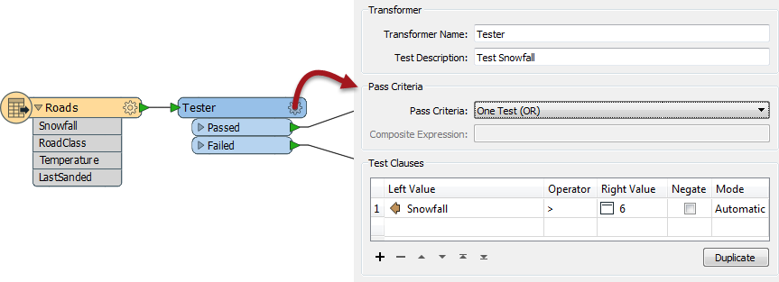

## The Tester and TestFilter Transformers ##

The Tester and TestFilter are the two key transformers for conditional filtering. They are for tests on attribute values.

### Tester ###

The Tester transformer (number 1 in the top 25) is generally for single tests that produce a Yes/No result. For example:

- Has there been more than six inches of snowfall?
- Is this a major road?
- Is the temperature less than zero degrees Celsius?
- Was sand last applied more than 24 hours ago?

Here, features will pass if the value of their Snowfall attribute is greater than six. If it is less than (or equal to) six, the feature will fail the test.

The Tester also allows the combination of multiple tests, where a user can combine any number of clauses using an AND and OR statement. For example, if I was trying to determine whether to send a snow plough to a particular road I might ask:

- Has there been more than six inches of snowfall AND is the temperature less than zero degrees Celsius? 
- Is this a major road AND (has there been more than six inches of snow OR (is the temperature less than zero AND was sand last applied more than 24 hours ago))?

When I have multiple tests I control them using the Pass Criteria field. A mix of AND/OR clauses requires a Composite Test, as shown above. But - however complex the test becomes - it still results in a single Yes/No result; features will either pass or fail this set of tests.

Notice we aren't restricted to simple tests of equality (A=B); in the above there are also "greater than" and "less than" tests.

---

#### Operators ####
There are a number of operators available in the Tester transformer (or in many of the other locations that make use of the Tester dialog):

Besides the usual operators, there are also some based on a SQL where clause. These include:

- In
- Between
- Like
- Matches Regex
- Contains
- Begins With
- Ends With

…plus there are other tests that test for the existence of attributes and values:

- Attribute is Null
- Attribute is Empty String
- Attribute is Missing

---

### TestFilter ###
The TestFilter (#12 in the top 25) is essentially a way to combine multiple Tester transformers into one.

Because of this, it’s equivalent to a whole string of Testers, and similar to the CASE or SWITCH command in programming or scripting languages. Instead of the Tester's single Passed and Failed ports, you can create an output port for each condition (it does not need to be called "Passed") and an output port for features that fail all of the test conditions.

The TestFilter has the full set of operands available with the Tester such as equals, greater than, less than, and so forth. Each condition is tested in turn.

Features that pass are output through the matching output port. Features that fail are sent on to the next condition in the list. Therefore it’s very important to get the conditions in the correct order.

TestFilter also lets the output ports be individually named, which is very convenient.

######TIP
*Because the TestFilter can operate as a single Tester transformer would, it’s possible to replace all instances of the Tester in a workspace with a TestFilter.*

In this example the user has used three Tester transformers (and six connections) to filter out the different parts of this data.

With the TestFilter, the three Testers are now replaced with one single transformer and there are only four connections.

Also notice how the TestFilter output ports have custom naming. This is another advantage to this transformer.