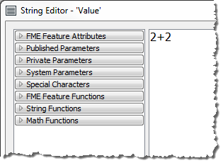

# Questions #

Here are the answers to the questions in this chapter.

---

<!--Person X Says Section-->

<table style="border-spacing: 0px">
<tr>
<td style="vertical-align:middle;background-color:darkorange;border: 2px solid darkorange">
<i class="fa fa-quote-left fa-lg fa-pull-left fa-fw" style="color:white;padding-right: 12px;vertical-align:text-top"></i>
Miss Vector says...
</td>
</tr>

<tr>
<td style="border: 1px solid darkorange">

Look at this screenshot of an editing dialog and tell me what the value returned to the attribute will be:
  
  1. 2+2
 2. 4
 3. 4.0
 4. Error!
  The key is to notice that the header of this dialog says "String Editor". Therefore the value returned to this attribute will be the literal string "2+2". If the user wishes to add 2+2 to get 4, they should have used the arithmetic editor!

</td>
</tr>
</table>

