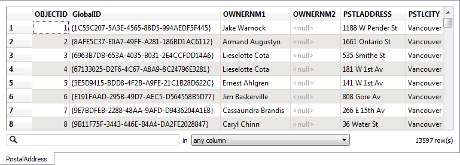

<!--Exercise Section-->
<!--NB: In GitBook world we don't give a number to exercises-->

<table style="border-spacing: 0px;border-collapse: collapse;font-family:serif">
<tr>
<td style="vertical-align:middle;background-color:darkorange;border: 2px solid darkorange">
<i class="fa fa-cogs fa-lg fa-pull-left fa-fw" style="color:white;padding-right: 12px;vertical-align:text-top"></i>
Exercise
</td>
<td style="border: 2px solid darkorange;background-color:darkorange;color:white">
Attribute Management Project
</td>
</tr>

<tr>
<td style="border: 1px solid darkorange; font-weight: bold">Data</td>
<td style="border: 1px solid darkorange">Addresses (File Geodatabase)</td>
</tr>

<tr>
<td style="border: 1px solid darkorange; font-weight: bold">Overall Goal</td>
<td style="border: 1px solid darkorange">Convert a File Geodatabase to GML and map the schema</td>
</tr>

<tr>
<td style="border: 1px solid darkorange; font-weight: bold">Demonstrates</td>
<td style="border: 1px solid darkorange">Attribute Management for Schema Mapping</td>
</tr>

<tr>
<td style="border: 1px solid darkorange; font-weight: bold">Start Workspace</td>
<td style="border: 1px solid darkorange">None</td>
</tr>

<tr>
<td style="border: 1px solid darkorange; font-weight: bold">End Workspace</td>
<td style="border: 1px solid darkorange">C:\FMEData2016\Workspaces\DesktopBasic\Transformers-Ex1-Complete.fmw</td>
</tr>

</table>

As part of a push for open government, the city's corporate address database is to be made available online. However, it is currently held in Esri File Geodatabase format and this is not thought suitable to deliver in its raw form. Instead the data will be translated to a GML/XML format and transformed into a new schema.

 **1) Inspect Data**
 As usual, the first task is to familiarize yourself with the data. To do this open the following dataset within the FME Data Inspector:

<table style="border: 0px">

<tr>
<td style="font-weight: bold">Reader Format</td>
<td style="">Esri Geodatabase (File Geodb API)</td>
</tr>

<tr>
<td style="font-weight: bold">Reader Dataset</td>
<td style="">C:\FMEData2015\Data\Addresses\Addresses.gdb</td>
</tr>

</table>

The table that is to be translated is called "PostalAddress." The important thing here is not how the data looks in the graphic display, but more what attributes exist in the Table View window.

Optionally you may wish to locate the file C:\FMEData2015\Resources\AddressSchema.xsd and open it in a text editor (or other XML file viewer). An xsd file describes the schema of an XML/GML dataset, and this file has been created to define what attributes we wish to have in our address GML dataset.

**2) Create Workspace**
 Now that you are familiar with both the source data and the required output schema, start FME Workbench and begin with an empty workspace. Select Readers > Add Reader from the menubar.

Add the Reader with the same values as in the Data Inspector.

<table style="border: 0px">

<tr>
<td style="font-weight: bold">Reader Format</td>
<td style="">Esri Geodatabase (File Geodb API)</td>
</tr>

<tr>
<td style="font-weight: bold">Reader Dataset</td>
<td style="">C:\FMEData2015\Data\Addresses\Addresses.gdb</td>
</tr>

</table>

When prompted, select only the PostalAddresses table, and no others:

**3) Add Writer**
 Now let's add a Writer to write the output data. Select Writers > Add Writer from the menubar and use the following:

<table style="border: 0px">

<tr>
<td style="font-weight: bold">Writer Format</td>
<td style="">GML (Geography Markup Language)</td>
</tr>

<tr>
<td style="font-weight: bold">Writer Dataset</td>
<td style="">C:\FMEData2015\Output\Training\AddressFile.gml</td>
</tr>

</table>

Select 'Import from Dataset' in the 'Add Feature Types' section of the dialog. Then Click OK to add the Writer.

**Import Feature Types**
 When prompted set the following parameters. The Dataset can be left as it is or emptied (left blank). It is not the important part:

<table style="border: 0px">

<tr>
<td style="font-weight: bold">Reader Format</td>
<td style="">GML (Geography Markup Language)</td>
</tr>

<tr>
<td style="font-weight: bold">Reader Dataset</td>
<td style=""></td>
</tr>

<tr>
<td style="font-weight: bold">Reader Parameters</td>
<td style="">Application Schema C:\FMEData2015\Resources\AddressSchema.xsd</td>
</tr>

</table>

Click OK to accept the values. The new feature type will be created to match the chosen GML application schema.

The workspace will now look like this:

**4) Map Schema**
 OK, we now have the Reader and Writer in place. Now we can start to map the schema from Reader to Writer. As you'll have noticed, the two do not currently match up very well.

Firstly let's clear up the Reader schema by hiding some of the unwanted attributes. 

Open the properties dialog for the Reader feature type. Click on the User Attributes tab to show the attributes available. Many of these are not required in the output. The simplest thing to do is
hide them from view in Workbench.

Uncheck the buttons against these attributes to hide them:

- OBJECTID
- GlobalID
- OWNERNM1
- OWNERNM2
- INTSTATE
- INTPSTLCD
- REPRESENT
- STATUS
- LASTUPDATE
- LASTEDITOR

Click OK to close the dialog.

**5) Add AttributeCopier**
 Several source attributes can be written to the output as they are, but do need renaming first.

Add an AttributeCopier transformer and connect it in between Reader and Writer feature types.

Open the parameters dialog. Set up the parameters to copy:

- PSTLCITY to City
- PSTLPROV to Province
- POSTALCODE to PostalCode

Notice how the source attributes remain in the data, as opposed to an AttributeRenamer transformer where they would be removed completely.

**6) Add BulkAttributeRenamer**
 Any attributes whose name matches, except for the case of the name (i.e. UPPER or lower or Title case) we can fix with the BulkAttributeRenamer. 

In our exercise there is only one attribute that falls into that scenario, but we'll use the BulkAttributeRenamer anyway for practice.

So, place a BulkAttributeRenamer into the workspace, after the AttributeCopier:

Open the parameters dialog. The only attribute we need to rename is COUNTRY. So change the Rename option to Selected Attributes and select COUNTRY:

Now set the Action parameter to Change Case, and the Case Change Type to "Title case":

Click OK to close the dialog. Notice how the attribute is renamed in the workspace:

***NB:** Yes, we could have just carried out this action in the AttributeCopier transformer, and for a single attribute we probably should. But this is a good way to familiarize you with the
BulkAttributeRenamer in the safety of a training exercise!*

***Question:** Why do you think we can't use the BulkAttributeReplacer transformer on the attribute POSTALCODE? Why not try it and see what happens?*

**7) Add AttributeCreator**
 Two attributes on the output (Provider and UpdateDate) are new and cannot be copied from the source data. They must be created. Provider can be created with an AttributeCreator.

Place an AttributeCreator transformer after the BulkAttributeRenamer. Open the parameters dialog. Set up the parameters to create the attribute Provider. Because the attribute does not already exist you'll need to type the new name, rather than select it from a drop-down list.

The value can be your own organization name, or "Safe Software" or "City of Interopolis."

On the next line create the attribute called UpdateDate. Rather than hard-coding a value we'll set it to "TODAY" and deal with that using the DateFormatter:

**8) Add DateFormatter**
 Add a DateFormatter transformer after the AttributeCreator. The DateFormatter can handle relative values - such as "yesterday" or "3 weeks ago" (see the documentation for a full list) - and so here we can use it to convert "TODAY" into a proper date value.

Select UpdateDate as the date attribute to process. Select "Unknown - Automatic Detection" as the source date format.

Select ISO Date as the destination date format as ISO is the format used in XML/GML for times and dates.

Click OK to close the dialog.

######TIP
Why not run the translation now, with Redirect to FME Data Inspector turned on, to see what the result of our efforts so far is?

**9) Add AttributeSplitter**
 Looking at the output schema there are two fields for Number and Street (for example "3305" and "W 10th Av"). However, the source schema condenses that information into one field with <space\> characters separating the fields ("3305 W 10th Av"). Therefore we'll have to split the source attribute up in order to match the Writer schema.

Insert an AttributeSplitter transformer. Open the parameters dialog. Set PSTLADDRESS as the attribute to split and enter a space character into the Delimiter parameter. Ensure that a list name is set in that particular parameter.

Click OK to close the dialog. If you run the workspace now you'll see the address as a list:

<pre>_list{0} (encoded: utf-8) 3305
_list{1} (encoded: utf-8) W
_list{2} (encoded: utf-8) 10th
_list{3} (encoded: utf-8) Av</pre>

**10) Add AttributeRemover**
 Now the PSTLADDRESS attribute has been split up into a list of items, we no longer need it. To clean up the data let's remove that attribute.

Add an AttributeRemover transformer and select PSTLADDRESS as the attribute to be removed.

The workspace will now look like this:

**11) Add AttributeRenamer**
 Now let's add an AttributeRenamer to handle the Number field in the output.

Place an AttributeRenamer transformer and open the parameters dialog.
For the "Old Attribute" field select _list{} (which is the list of separated values created by the AttributeSplitter). You will be prompted which item in the list is to be used. It will be the first
part - entry number 0 - so simply click OK to accept this.

Now for the "New Attribute" field select Number from the drop down list

Click OK to close the dialog.

**12) Add StringConcatenator**
 The final step is to recreate the Street attribute, without it being prefixed by the address number.

Place a StringConcatenator transformer and open the parameters dialog. If necessary, click the button labelled 'Switch To Advanced'.

For the Destination Attribute field enter the name Street

In the Expression field double-click _list{} to select a list item. When prompted select list item 1.

Press the spacebar to enter a <space\> character.

Double-click _list{} again and this time select list item 2.

Again press the spacebar and double-click _list{} again, this time selecting item 3.

The dialog will now look like this:

In this way we will have concatenated all parts of the street name back together, for example:

<pre>"W"+"17th"+"St" becomes "W 17th St"</pre>

We're assuming that no street name has more than three parts to it, but that's reasonable for our example.

**13) Run Workspace**
 Save and then run the workspace.

Open the containing folder to check the output has been written. There should be both an output file and schema document. Inspect the data in the FME Data Inspector. The output (with a background map turned on) should look like this:

Querying a feature will return all of the attributes we've just put together:

Congratulations! You have now:

- Used various transformers to manage attributes and map a schema
